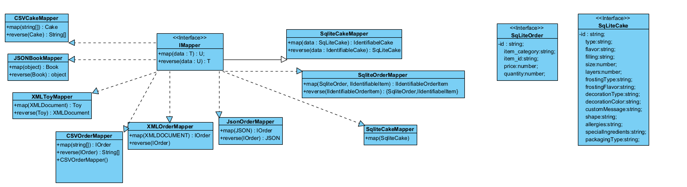

🎂 UML-Based Cake Ordering System

This repository contains the UML design and implementation of a Items Ordering System with support for different storage formats (CSV, JSON, XML, SQLite) and extensible repositories for managing cakes, books, and toys.

📌 UML Diagrams
1. Mapper & Storage UML

This diagram shows how data is mapped between different formats (CSV, JSON, XML, SQLite) and the system’s domain objects.

IMapper Interface → Defines map() and reverse() for converting between data and objects.

Specialized Mappers → CSVCakeMapper, JSONBookMapper, XMLToyMapper, etc.

SQLite Mappers → Handle persistence in relational DB for Cake and Order.

2. Repository & Builder UML

This diagram shows how orders, cakes, books, and toys are represented and managed using repositories and the builder pattern.

Repository Layer → Provides create, get, update, delete operations.

Domain Models → CakeModel, BookModel, ToyModel, Order.

Builders → CakeBuilder, BookBuilder, ToyBuilder for object creation.

Identifiable Entities → Each item (Cake, Book, Toy) can be tracked with unique IDs.

🚀 Features

Multiple storage mappers: CSV, JSON, XML, SQLite.

Flexible repository system with interfaces for easy extension.

Builder pattern for constructing objects step by step.

Clear separation of concerns between persistence, domain models, and builders.
  

  

